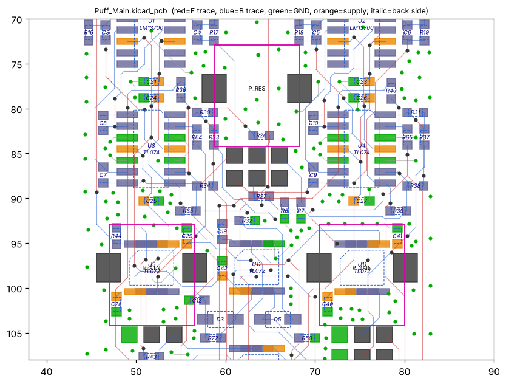
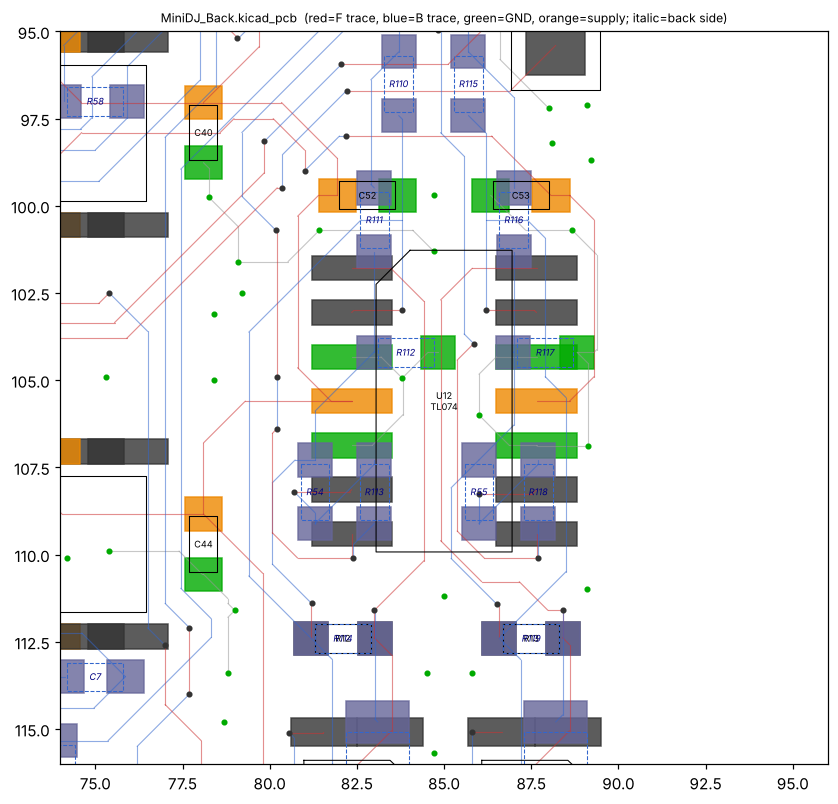
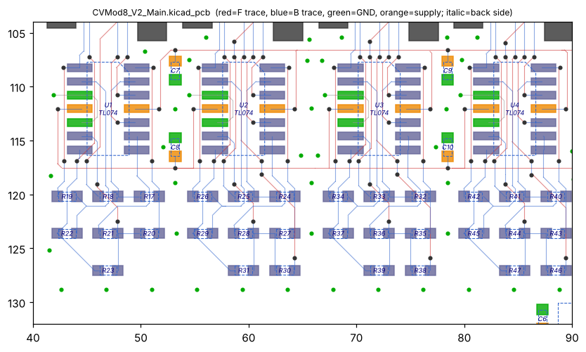
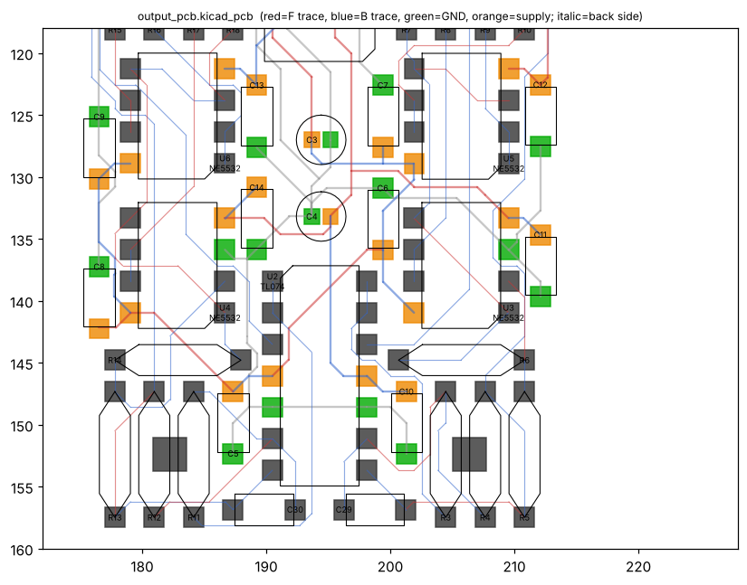

# Op-amp placement: passives around op-amps, and spacing between op-amps

Measured from KiCad layouts in three open-source Eurorack repos:
[Thorinair/Avalon-Harmonics](https://github.com/Thorinair/Avalon-Harmonics),
[QuinnFreedman/modular](https://github.com/QuinnFreedman/modular) and
[Allen-Synthesis/EuroPi](https://github.com/Allen-Synthesis/EuroPi).
That is 121 op-amps (TL072/TL074, LM324/LM358, NE5532, MCP6002/MCP6004) on 36 boards, all 2-layer. The repos are pooled. Results are split by technology:

- **THT:** DIP op-amp with through-hole passives.
- **SMD:** SOIC op-amp with SMD passives.

No board mixes an SOIC op-amp with through-hole passives, so that combination isn't in the data.

All distances are in mm.

## How it was measured

- **Roles.** Each two-pad R or C connected to an op-amp section got a role from its nets:
  - *feedback*: connects the − pin to the output pin;
  - *− to ground*: connects the − pin to ground;
  - *input on the − pin*: connects the − pin to some other signal;
  - *+ input*, *+ to ground*, *output series*: the same idea for the + pin and the output pin;
  - *decoupling cap*: a cap from a supply pin to ground.
- **Distance.** For each part, the distance from its connected pad to the op-amp pin it connects to. For feedback parts it's the closer of the two ends.
- **Pinouts.** Standard pinouts were assumed: 8-pin A = out 1, − 2, + 3 and B = + 5, − 6, out 7; 14-pin adds C = out 8, − 9, + 10 and D = + 12, − 13, out 14.
- **Body gap.** The gap between drawn outlines (Fab layer or courtyard, plus pads).

## 1. Passives around an op-amp

### How close each role sits to its pin

Share of parts whose connected pad is within 3 / 6 / 10 mm of the pin:

| Role | THT | SMD |
|---|---|---|
| Feedback | 1% / 23% / 49% (n=74) | **36% / 58% / 65%** (n=130) |
| − to ground | 0% / 24% / 40% (n=25) | 17% / 46% / 88% (n=24) |
| Input on the − pin | 1% / 4% / 11% (n=99) | 16% / 30% / 54% (n=164) |
| + input | 0% / 13% / 17% (n=47) | 15% / 28% / 46% (n=39) |
| + to ground | 0% / 4% / 15% (n=47) | 21% / 37% / 53% (n=38) |
| Output series | 1% / 8% / 20% (n=125) | 7% / 30% / 58% (n=192) |
| Decoupling cap | 19% within 3, 41% within 6, median 10.9 (n=116) | 27% within 3, 61% within 6, median 5.8 (n=109) |

### Patterns

1. **The decoupling cap is the closest part to the chip.** It was the nearest R or C to the op-amp in 88 of 121 cases, THT and SMD alike.
2. **On SMD boards, the feedback parts come next.** They're closer than any other signal part. After them come the part from the − pin to ground, then the input and + parts. The output series resistor is usually last.
3. **SMD parts point away from the chip.** About 60% of feedback parts and 71% of input resistors lie perpendicular to the pin rows, running outward from their pin. THT parts show no consistent orientation (roughly 45% parallel, 55% perpendicular).
4. **The tightest feedback placement is directly under the chip, on the other face.** 40 of 130 SMD feedback parts sit there, with their pads a median 1.6 mm from the pins (most between 0.3 and 2.8 mm). Nothing else in the data gets as close. It needs SMD parts assembled on both faces.
5. **A THT feedback resistor can't land on both pins.** The − and output pins are 2.54 mm apart, while an axial resistor's leads are 7.6–10 mm apart. It lies along the chip instead: body gap median 3.6 mm, closest quarter 1.1 mm or less. Almost all (72 of 74) are on the same face as the chip.
6. **Resistors sit in banks.** A resistor counts as in a bank if it has a parallel neighbour within 4.2 mm. That's true of about half of THT resistors (237 of 502) and three-quarters of SMD resistors (401 of 530). On THT boards the banks sit near the chip rather than at individual pins.
7. **On THT boards, input and + resistors mostly sit at the jacks and pots, not at the chip.** Only 11% of − input resistors are within 10 mm of the chip. The long trace then runs on the − side of the resistor; the median copper on a − node is 30–32 mm on THT boards and about 16 mm on SMD boards. This works for these designs, but it's worse practice than keeping the − node short.
8. **Parts aren't strictly grouped by op-amp section.** Only about half sit nearer their own section's pins than another section's. Placement follows what routes easily rather than neat per-section clusters.

## 2. Spacing between op-amps

Each op-amp's nearest neighbour of the same type, on the same face (55 of each):

| | THT (DIP) | SMD (SOIC) |
|---|---|---|
| Centre to centre | min 4.6, middle half 12.6–28.7, **median 21.6** | min 7.6, middle half 10.3–14.0, **median 12.6** |
| Gap between bodies | min 0.6, middle half 2.4–20.1, **median 8.8** | min 0.8, middle half 2.8–6.5, **median 5.0** |
| Turned the same way as the neighbour | 39 of 55 | 37 of 55 |
| On a common row or column (centres within 0.5 mm) | 35 of 55 | 40 of 55 |
| Neighbour beside it rather than end to end | 27 of 55 | 30 of 55 |

- **SMD op-amps are spaced evenly.** A gap of about 5 mm between bodies is enough for each chip's feedback parts and decoupling cap on its facing side.
- **THT op-amps are spaced unevenly.** Their resistor banks often sit between chips and push them apart. A few sit nearly touching, with their parts placed elsewhere.
- **Most boards line op-amps up.** About two-thirds share a rotation and sit on a common row or column.

## Figures

How to read the figures:
- **Dashed blue outlines and italic labels** are parts on the back; **solid black outlines** are parts on the front. **Magenta outlines** are jack and pot bodies.
- **Pads:** green = ground, orange = supply. **Traces:** red = front, blue = back, grey = ground. **Dots** are vias.

*Avalon-Harmonics Puff main board (SMD): the 0603 passives fan out perpendicular to the SOIC pin rows on both faces. The jack/pot (magenta) sits right next to the op-amps, with back-side parts under it.*

*Avalon-Harmonics MiniDJ back board (SMD, both faces assembled): U12 is on the front. Its feedback and input resistors (R111–R113, R116–R118) are on the back, directly under the pin rows, about 1–2 mm from the pins (pattern 4).*

*Avalon-Harmonics CVMod8 V2 main board (SMD): a row of identical channels. TL074s at about 11 mm pitch, all turned the same way and on one line. One pair of decoupling caps (C7/C8, C9/C10) sits between each two chips, with identical resistor banks below (patterns 6 and section 2).*

*QuinnFreedman Output board (THT): each DIP supply pin (orange pads) has a 100 nF cap right beside it. The axial resistors stand in parallel banks a little way off, not at individual pins (patterns 1, 5 and 6).*

## 3. Suggested placement rules

### SMD op-amps with SMD passives

1. **Decoupling cap first.** It is the closest part to each supply pin, within 3 mm, with its own ground via.
2. **Feedback R and C second.** They straddle the − and output pins, within 3 mm of both, lying perpendicular to the pin row and pointing outward.
3. **Then the rest of the − pin's parts** (input resistor, offset resistor, any part to ground), within 6 mm. Then the + pin's parts, then the output series resistor, within 10 mm.
4. **Keep the long trace on the far side of the input resistor**, so the − node stays short. This is stricter than these boards (pattern 7). It matters most for precision channels such as 1V/OCT and ADC inputs.
5. **Repeated channels get identical banks** of parallel resistors at the same pitch. Lay out one channel and copy it.
6. **Neighbouring op-amps sit 12–14 mm apart centre to centre** (about 5 mm between bodies), turned the same way and on a common row or column.
7. **Option, if both faces are assembled:** put the feedback parts directly under the chip on the other face. That gives the shortest − node, at extra assembly cost.

### SOIC op-amps with THT passives

This combination isn't in the data. The rules below carry over the THT findings.

1. **Each supply pin's 100 nF cap is still the closest part to the chip.** Put it right beside the pin with its leads short.
2. **Put the passives in a bank alongside the chip.** Bodies 1–4 mm from the chip, parallel to the pin rows, at 3.17 mm pitch, with each part's lead opposite the pin it connects to.
3. **Parts on high-impedance nodes (1 MΩ class) go right at their pin.** That's stricter than the THT boards, but high-impedance nodes are what need it.
4. **Expect wider op-amp spacing than SMD.** THT banks between chips gave a median of 21.6 mm centre to centre. Allow room for one bank between neighbouring op-amps.

## Limits

- Roles come from net connections, so an unusual circuit can land in the wrong role.
- Distances are straight lines from pad to pin, not routed trace lengths. The only exception is the − node copper figure in pattern 7, which is the total length of trace on the node.
- Outlines are the drawn footprint graphics, not measured part dimensions.
